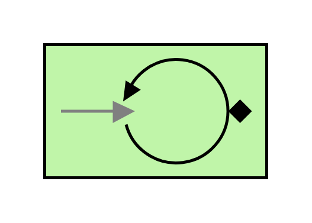

# Polling Consumer

## Definition

```js
{
  _style: {
    entity: 'fillColor=#c0f5a9;dashed=0;outlineConnect=0;strokeWidth=2;html=1;align=center;fontSize=8;verticalLabelPosition=bottom;verticalAlign=top;shape=mxgraph.eip.polling_consumer;',
  },
  _width: 150,
  _height: 90,
}
```

## Usage

```js
import { PollingConsumer } from '@dinghy/standard-components-diagrams/eipMessagingEndpoints'

<PollingConsumer/>
```

## Preview


