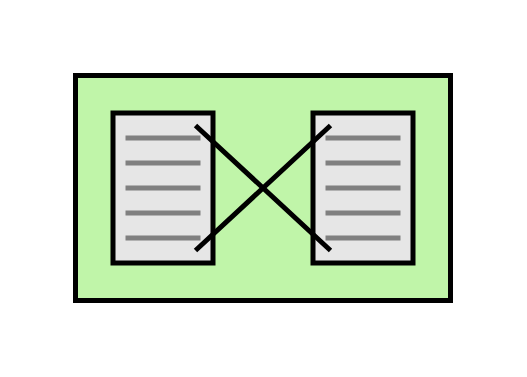

# Message-Translator

## Definition

```js
{
  _style: {
    entity: 'html=1;strokeWidth=2;outlineConnect=0;dashed=0;align=center;fontSize=8;shape=mxgraph.eip.message_translator;fillColor=#c0f5a9;verticalLabelPosition=bottom;verticalAlign=top;',
  },
  _width: 150,
  _height: 90,
}
```

## Usage

```js
import { MessageTranslator } from '@dinghy/standard-components-diagrams/eipMessagingSystems'

<MessageTranslator/>
```

## Preview


