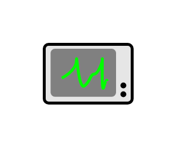

# Control Bus

## Definition

```js
{
  _style: {
    entity: 'html=1;strokeWidth=2;outlineConnect=0;dashed=0;align=center;fontSize=8;verticalLabelPosition=bottom;verticalAlign=top;shape=mxgraph.eip.control_bus;fillColor=#c0f5a9',
  },
  _width: 60,
  _height: 40,
}
```

## Usage

```js
import { ControlBus } from '@dinghy/standard-components-diagrams/eipSystemManagement'

<ControlBus/>
```

## Preview


