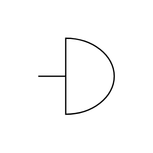
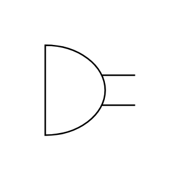
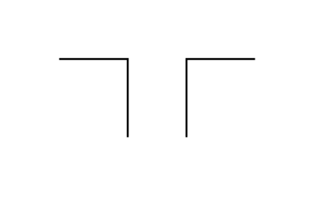
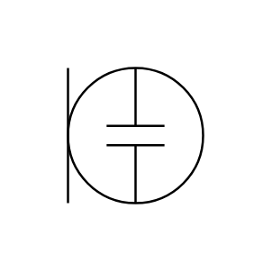
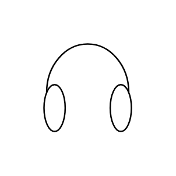
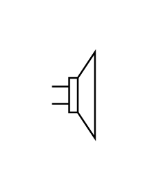
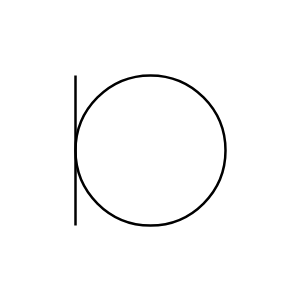
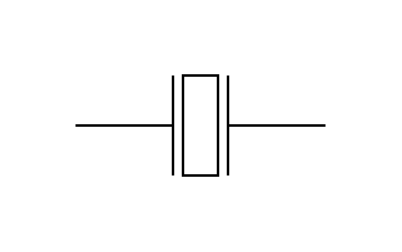

# Electrical Audio Entities

- [Bell](./bell.md)  

- [Buzzer](./buzzer.md)  

- [Dipole](./dipole.md)  

- [ElectretMicrophone](./electret-microphone.md)  

- [Headphones](./headphones.md)  

- [Loudspeaker](./loudspeaker.md)  

- [Microphone](./microphone.md)  

- [Microphone2](./microphone-2.md)  

- [PiezoSounder](./piezo-sounder.md)  

