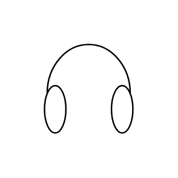

# Headphones

## Definition

```js
{
  _style: {
    entity: 'verticalLabelPosition=bottom;shadow=0;dashed=0;align=center;html=1;verticalAlign=top;shape=mxgraph.electrical.radio.headphones;pointerEvents=1;',
  },
  _original_width: 66,
  _original_height: 56,

}
```

## Usage

```js
import { Headphones } from '@dinghy/standard-components-diagrams/electricalAudio'

<Headphones/>
```

## Preview


