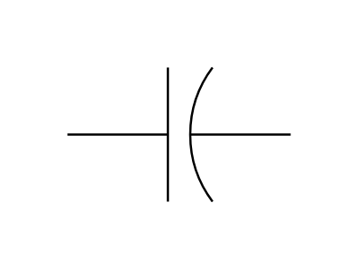
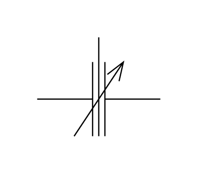
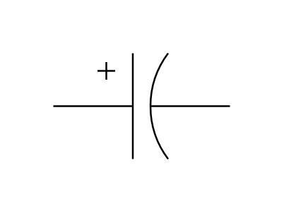
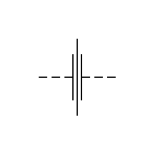
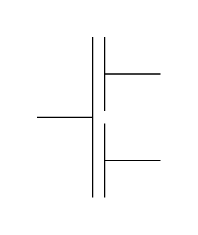

# Electrical Capacitors Entities

- [Capacitor](./capacitor.md)  

- [CapacitorUk](./capacitor-uk.md)  

- [CapacitorUs](./capacitor-us.md)  

- [CapacitorUs2](./capacitor-us-2.md)  

- [DifferentialCapacitor](./differential-capacitor.md)  

- [ElectrolyticCapacitorUs](./electrolytic-capacitor-us.md)  

- [ElectrolyticCapacitorUs2](./electrolytic-capacitor-us-2.md)  

- [FeedThroughCapacitor](./feed-through-capacitor.md)  

- [GangedCapacitor](./ganged-capacitor.md)  

- [MultipleCapacitor](./multiple-capacitor.md)  

- [MultipleElectrolyticCapacitorCommonNegative](./multiple-electrolytic-capacitor-common-negative.md)  

- [MultipleElectrolyticCapacitorCommonPositive](./multiple-electrolytic-capacitor-common-positive.md)  

- [TrimmerVariableCapacitorUs](./trimmer-variable-capacitor-us.md)  

- [TrimmerVariableCapacitorUs2](./trimmer-variable-capacitor-us-2.md)  

- [TuningVariableCapacitorUs](./tuning-variable-capacitor-us.md)  

- [TuningVariableCapacitorUs2](./tuning-variable-capacitor-us-2.md)  

