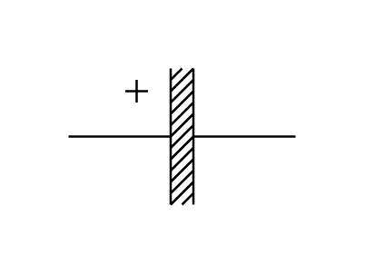

# Capacitor

## Definition

```js
{
  _style: {
    entity: 'pointerEvents=1;verticalLabelPosition=bottom;shadow=0;dashed=0;align=center;html=1;verticalAlign=top;shape=mxgraph.electrical.capacitors.capacitor_6;',
  },
  _width: 100,
  _height: 60,
}
```

## Usage

```js
import { Capacitor } from '@dinghy/standard-components-diagrams/electricalCapacitors'

<Capacitor/>
```

## Preview


