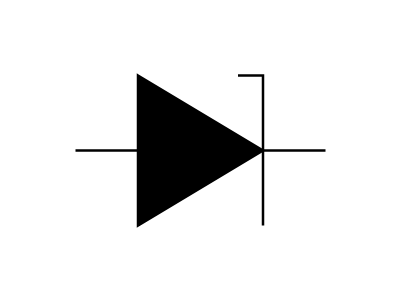
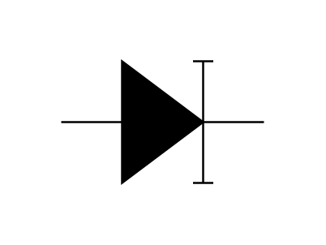
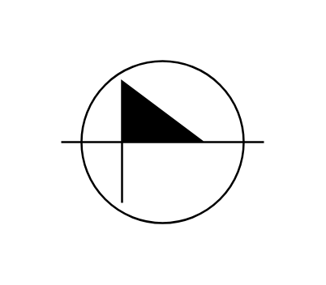
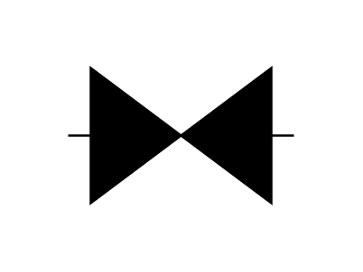
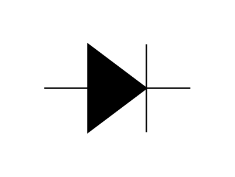
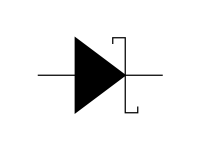
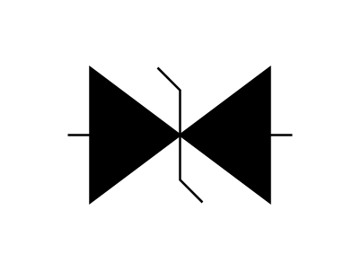
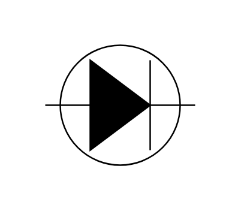
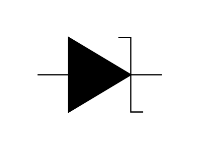
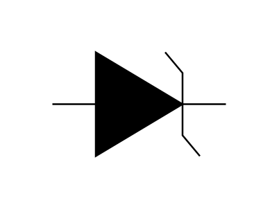

# Electrical Diodes Entities

- [Breakdown](./breakdown.md)  

- [FieldEffectDiode](./field-effect-diode.md)  

- [FourLayerDiode](./four-layer-diode.md)  

- [GunnDiode](./gunn-diode.md)  

- [PnDiode](./pn-diode.md)  

- [SchottkyDiode](./schottky-diode.md)  

- [Transorb1](./transorb-1.md)  

- [Transorb2](./transorb-2.md)  

- [TunnelDiode1](./tunnel-diode-1.md)  

- [TunnelDiode2](./tunnel-diode-2.md)  

- [VaractorVaricap](./varactor-varicap.md)  

- [ZenerDiode1](./zener-diode-1.md)  

- [ZenerDiode2](./zener-diode-2.md)  

