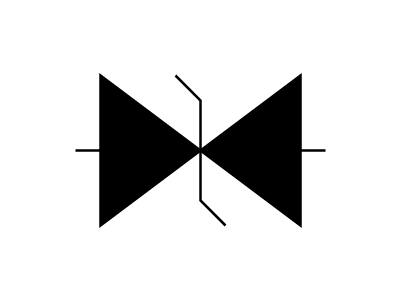

# Transorb 2

## Definition

```js
{
  _style: {
    entity: 'pointerEvents=1;fillColor=strokeColor;verticalLabelPosition=bottom;shadow=0;dashed=0;align=center;html=1;verticalAlign=top;shape=mxgraph.electrical.diodes.transorb_2;',
  },
  _width: 100,
  _height: 60,
}
```

## Usage

```js
import { Transorb2 } from '@dinghy/standard-components-diagrams/electricalDiodes'

<Transorb2/>
```

## Preview


