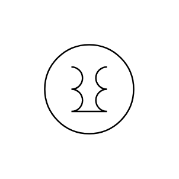

# 1-Phase Induction Voltage Regulator

## Definition

```js
{
  _style: {
    entity: 'pointerEvents=1;verticalLabelPosition=bottom;shadow=0;dashed=0;align=center;html=1;verticalAlign=top;shape=mxgraph.electrical.inductors.1_phase_induction_volt_reg;',
  },
  _original_width: 100,
  _original_height: 100,

}
```

## Usage

```js
import { Component1PhaseInductionVoltageRegulator } from '@dinghy/standard-components-diagrams/electricalInductors'

<Component1PhaseInductionVoltageRegulator/>
```

## Preview


