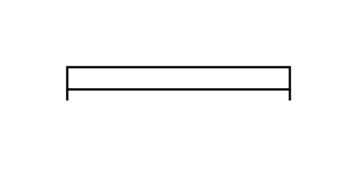

# Inductor (Air Core) 3

## Definition

```js
{
  _style: {
    entity: 'pointerEvents=1;verticalLabelPosition=bottom;shadow=0;dashed=0;align=center;html=1;verticalAlign=top;shape=mxgraph.electrical.inductors.inductor_1;',
  },
  _width: 100,
  _height: 15,
}
```

## Usage

```js
import { InductorAirCore3 } from '@dinghy/standard-components-diagrams/electricalInductors'

<InductorAirCore3/>
```

## Preview


