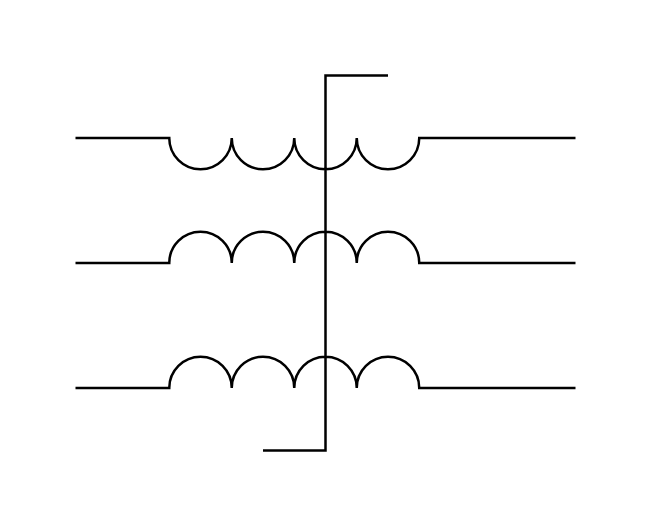

# Saturating Transformer

## Definition

```js
{
  _style: {
    entity: 'pointerEvents=1;verticalLabelPosition=bottom;shadow=0;dashed=0;align=center;html=1;verticalAlign=top;shape=mxgraph.electrical.inductors.saturating_transformer;',
  },
  _width: 200,
  _height: 150,
}
```

## Usage

```js
import { SaturatingTransformer } from '@dinghy/standard-components-diagrams/electricalInductors'

<SaturatingTransformer/>
```

## Preview


