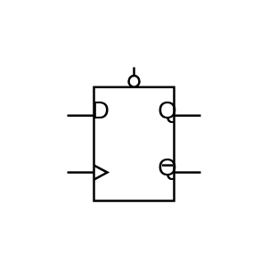

# D Type Flip-Flop With Clear

## Definition

```js
{
  _style: {
    entity: 'verticalLabelPosition=bottom;shadow=0;dashed=0;align=center;html=1;verticalAlign=top;shape=mxgraph.electrical.logic_gates.d_type_flip-flop_with_clear_2;',
  },
  _original_width: 100,
  _original_height: 90,

}
```

## Usage

```js
import { DTypeFlipFlopWithClear } from '@dinghy/standard-components-diagrams/electricalLogicGates'

<DTypeFlipFlopWithClear/>
```

## Preview


