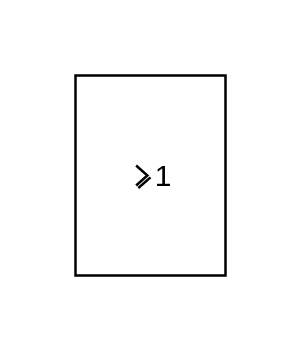

# OR (IEC)

## Definition

```js
{
  _style: {
    entity: 'verticalLabelPosition=bottom;shadow=0;dashed=0;align=center;html=1;verticalAlign=top;shape=mxgraph.electrical.iec_logic_gates.or;',
  },
  _width: 60,
  _height: 80,
}
```

## Usage

```js
import { OrIec } from '@dinghy/standard-components-diagrams/electricalLogicGates'

<OrIec/>
```

## Preview


