# Electrical Misc Entities

- [Component2ConductorJack](./component-2-conductor-jack.md)  
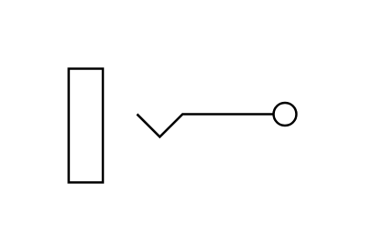

- [Component2ConductorPlug](./component-2-conductor-plug.md)  
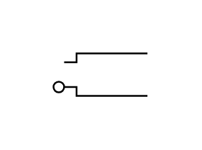

- [Component3ConductorPlug](./component-3-conductor-plug.md)  

- [Component3ConductorJack](./component-3-conductor-jack.md)  

- [AcOut](./ac-out.md)  
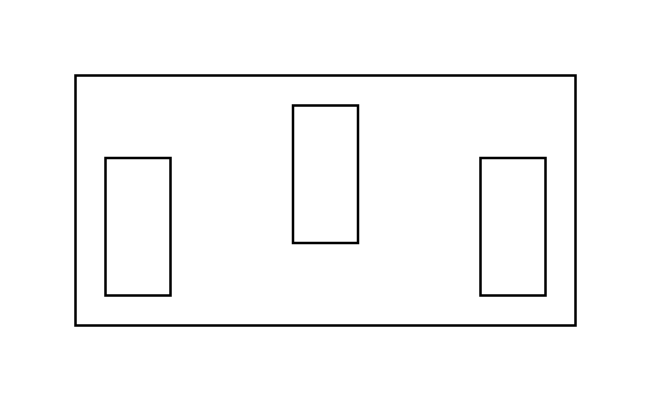

- [Adapter](./adapter.md)  
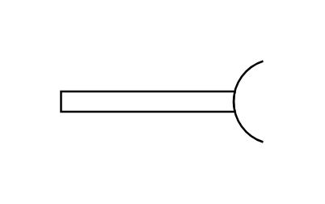

- [Amplifier](./amplifier.md)  
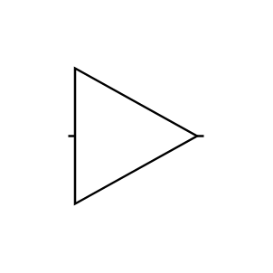

- [Antenna](./antenna.md)  
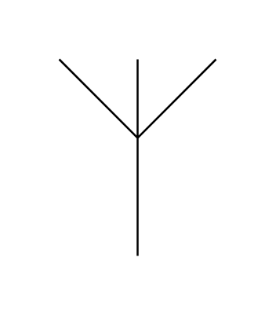

- [Antenna2](./antenna-2.md)  
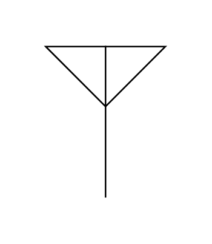

- [BandpassFilter](./bandpass-filter.md)  

- [Buzzer](./buzzer.md)  
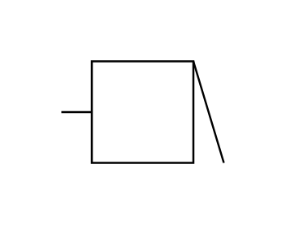

- [CHeaderConnector](./c-header-connector.md)  

- [CableTermination](./cable-termination.md)  
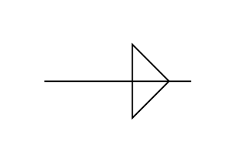

- [Chassis](./chassis.md)  
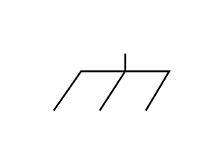

- [CircuitBreaker](./circuit-breaker.md)  
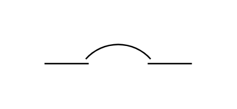

- [CircuitTerminal](./circuit-terminal.md)  

- [CoAx](./co-ax.md)  
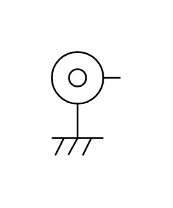

- [CoaxialCenterConductor](./coaxial-center-conductor.md)  
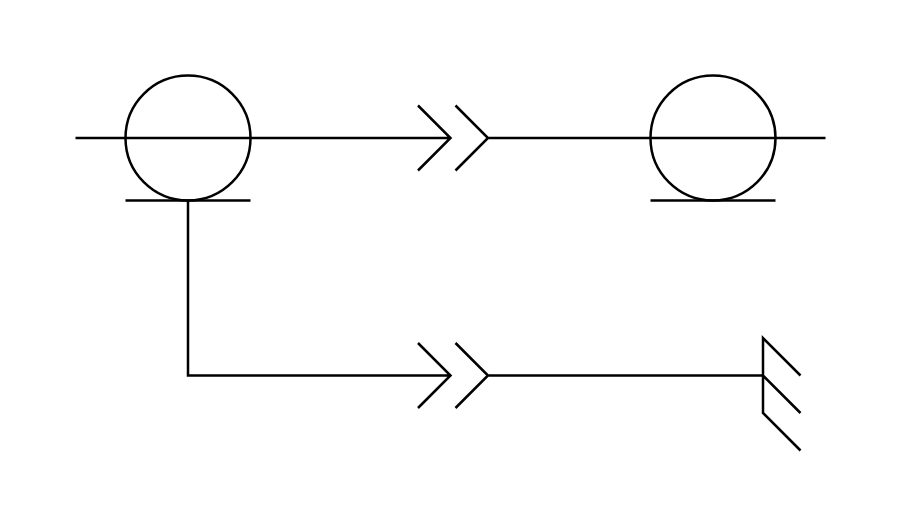

- [CoaxialJackPlug](./coaxial-jack-plug.md)  

- [CoaxialOutsideConductor](./coaxial-outside-conductor.md)  
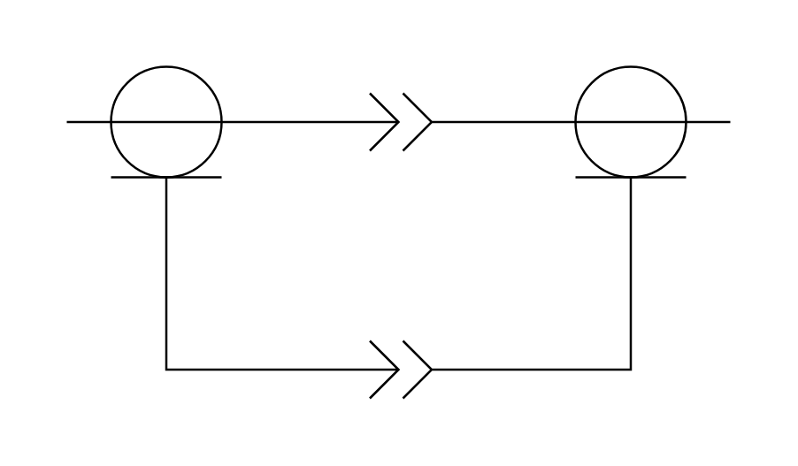

- [ControlledAmplifier](./controlled-amplifier.md)  
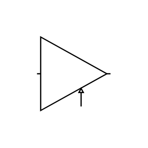

- [Crystal](./crystal.md)  

- [CurrentFlow](./current-flow.md)  
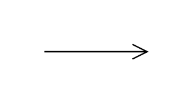

- [Dac](./dac.md)  
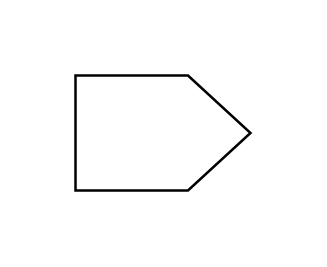

- [DelayElement](./delay-element.md)  
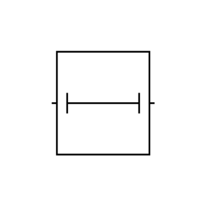

- [Delta](./delta.md)  
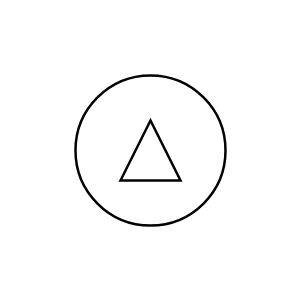

- [Demux](./demux.md)  
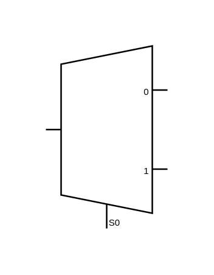

- [ElectricalMotor](./electrical-motor.md)  

- [Equipotential](./equipotential.md)  
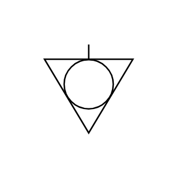

- [Equipotential2](./equipotential-2.md)  
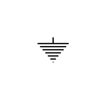

- [FM2Conductor](./f-m-2-conductor.md)  
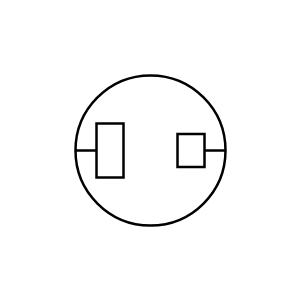

- [FM2Conductor2](./f-m-2-conductor-2.md)  
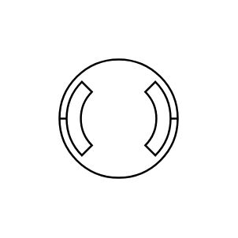

- [FM2Conductor3](./f-m-2-conductor-3.md)  
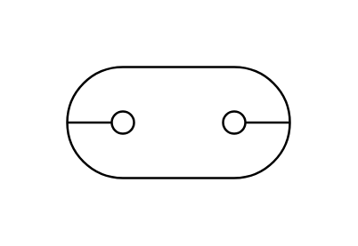

- [FM3Conductor](./f-m-3-conductor.md)  

- [FM3Conductor2](./f-m-3-conductor-2.md)  
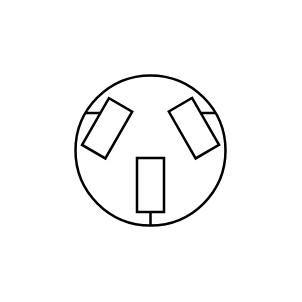

- [FM3Conductor3](./f-m-3-conductor-3.md)  
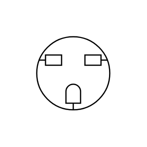

- [FM3Conductor4](./f-m-3-conductor-4.md)  

- [FM3Conductor5](./f-m-3-conductor-5.md)  
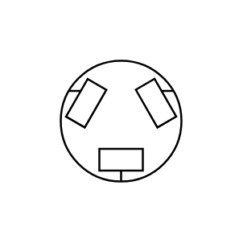

- [Filter](./filter.md)  
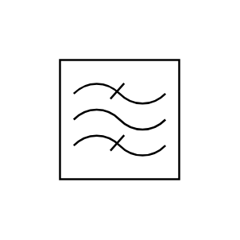

- [FlourescentLamp](./flourescent-lamp.md)  

- [Function](./function.md)  

- [FuseIec](./fuse-iec.md)  
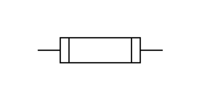

- [FuseIeee](./fuse-ieee.md)  
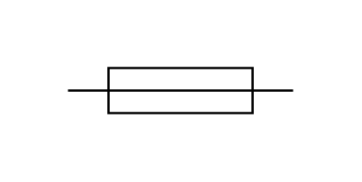

- [FuseIeee2](./fuse-ieee-2.md)  

- [FuseObsolete](./fuse-obsolete.md)  
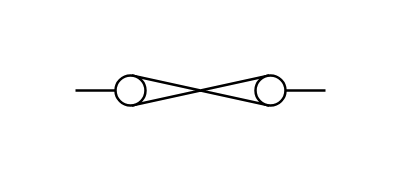

- [GenericComponent](./generic-component.md)  

- [Ground](./ground.md)  
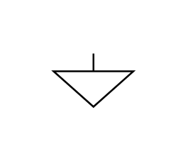

- [HighpassFilter](./highpass-filter.md)  
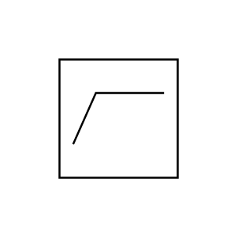

- [IgniterPlug](./igniter-plug.md)  
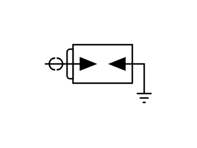

- [IlluminatingBulb](./illuminating-bulb.md)  

- [Indicator](./indicator.md)  

- [Integrator](./integrator.md)  
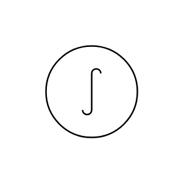

- [Lamp](./lamp.md)  
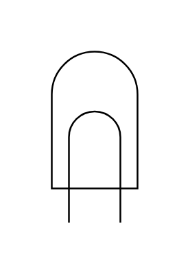

- [LargeDConnector](./large-d-connector.md)  
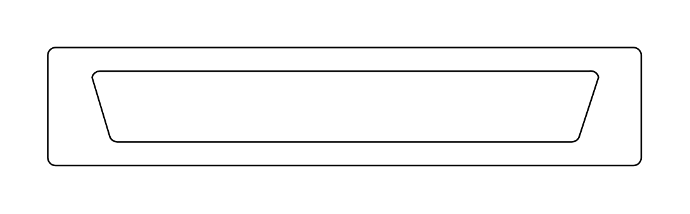

- [LightBulb](./light-bulb.md)  
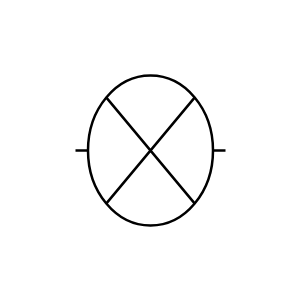

- [LoopAntenna](./loop-antenna.md)  
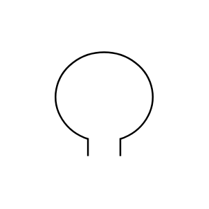

- [LoopAntenna2](./loop-antenna-2.md)  
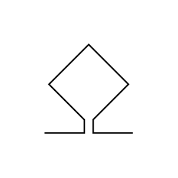

- [LowpassFilter](./lowpass-filter.md)  

- [MFContact2](./m-f-contact-2.md)  
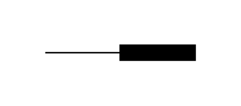

- [Material](./material.md)  
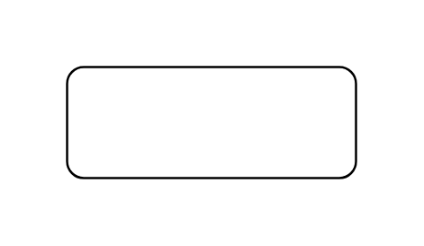

- [MotorArmature](./motor-armature.md)  
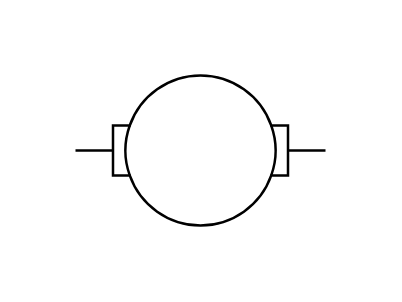

- [Multiplier](./multiplier.md)  
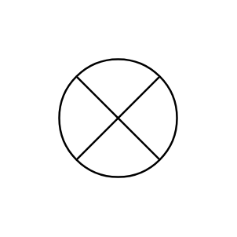

- [Mux](./mux.md)  

- [NeonLamp](./neon-lamp.md)  
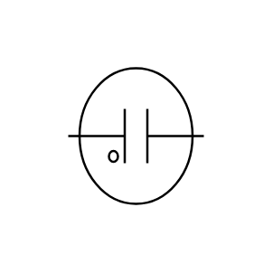

- [NormalledJack](./normalled-jack.md)  
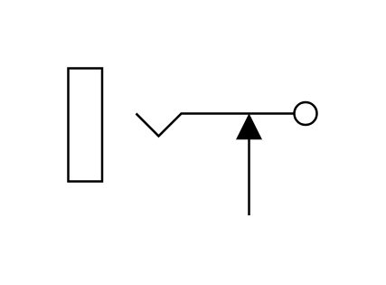

- [NormalledJacks](./normalled-jacks.md)  
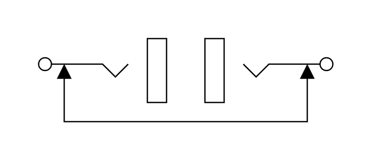

- [OperationalAmp](./operational-amp.md)  
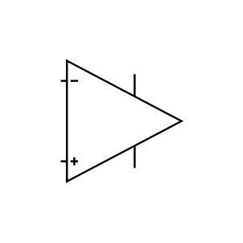

- [OperationalAmp2](./operational-amp-2.md)  
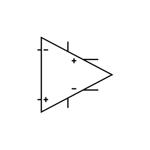

- [Ota](./ota.md)  

- [Ota2](./ota-2.md)  

- [Ota3](./ota-3.md)  

- [PermanentMagnet](./permanent-magnet.md)  

- [PickupHead](./pickup-head.md)  

- [PlugSocketConnection](./plug-socket-connection.md)  

- [Quantizer](./quantizer.md)  

- [SensingLinkSquib](./sensing-link-squib.md)  

- [ShieldedJackPlug](./shielded-jack-plug.md)  

- [SmallDConnector](./small-d-connector.md)  

- [SquibIgnitor](./squib-ignitor.md)  

- [Sum](./sum.md)  

- [SummationPoint](./summation-point.md)  

- [SurgeProtector](./surge-protector.md)  

- [SurgeProtector2](./surge-protector-2.md)  

- [TerminalBoard](./terminal-board.md)  

- [ThermalElement](./thermal-element.md)  

- [ThermistorWithIndependentIntegralHeater](./thermistor-with-independent-integral-heater.md)  

- [Thermocouple](./thermocouple.md)  

- [Thermopile](./thermopile.md)  

- [Transducer](./transducer.md)  

- [Transducer2](./transducer-2.md)  

- [Vdd](./vdd.md)  

- [Voltage](./voltage.md)  

- [VoltageRegulator](./voltage-regulator.md)  

- [Vss](./vss.md)  

