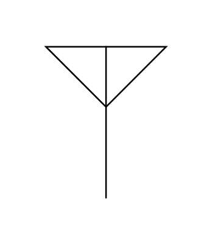

# Antenna 2

## Definition

```js
{
  _style: {
    entity: 'verticalLabelPosition=bottom;shadow=0;dashed=0;align=center;html=1;verticalAlign=top;shape=mxgraph.electrical.radio.aerial_-_antenna_2;',
  },
  _width: 79,
  _height: 100,
}
```

## Usage

```js
import { Antenna2 } from '@dinghy/standard-components-diagrams/electricalMisc'

<Antenna2/>
```

## Preview


