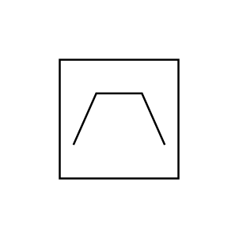

# Bandpass Filter

## Definition

```js
{
  _style: {
    entity: 'verticalLabelPosition=bottom;shadow=0;dashed=0;align=center;html=1;verticalAlign=top;shape=mxgraph.electrical.logic_gates.bandpass_filter;',
  },
  _original_width: 52,
  _original_height: 46,

}
```

## Usage

```js
import { BandpassFilter } from '@dinghy/standard-components-diagrams/electricalMisc'

<BandpassFilter/>
```

## Preview


