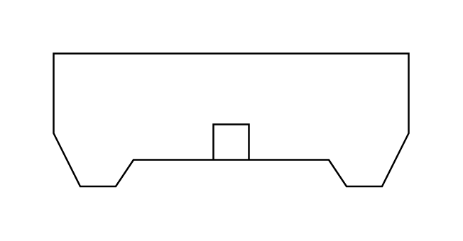

# C Header Connector

## Definition

```js
{
  _style: {
    entity: 'pointerEvents=1;verticalLabelPosition=bottom;shadow=0;dashed=0;align=center;html=1;verticalAlign=top;shape=mxgraph.electrical.miscellaneous.c_header_connector',
  },
  _width: 200,
  _height: 75,
}
```

## Usage

```js
import { CHeaderConnector } from '@dinghy/standard-components-diagrams/electricalMisc'

<CHeaderConnector/>
```

## Preview


