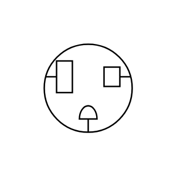

# F/M 3 Conductor

## Definition

```js
{
  _style: {
    entity: 'pointerEvents=1;verticalLabelPosition=bottom;shadow=0;dashed=0;align=center;html=1;verticalAlign=top;shape=mxgraph.electrical.miscellaneous.f_m_3_conductor_1',
  },
  _original_width: 100,
  _original_height: 100,

}
```

## Usage

```js
import { FM3Conductor } from '@dinghy/standard-components-diagrams/electricalMisc'

<FM3Conductor/>
```

## Preview


