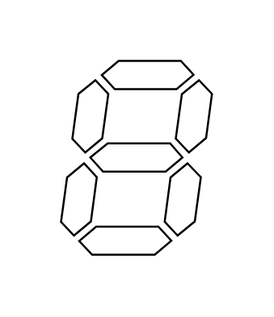
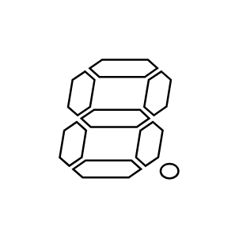
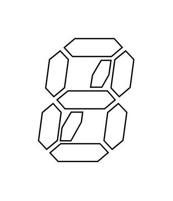
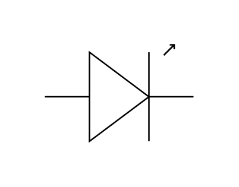
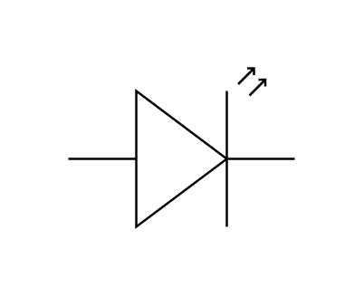
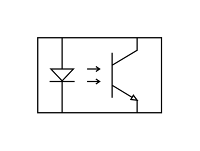
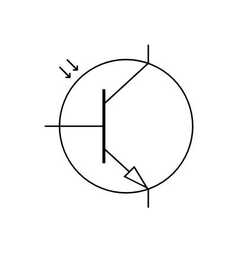
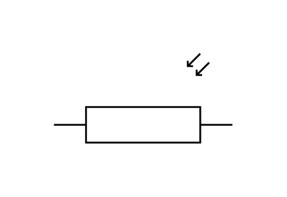
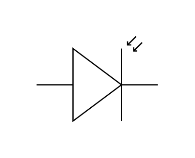

# Electrical Optical Entities

- [Component7SegmentDisplay](./component-7-segment-display.md)  

- [Component7SegmentDisplayWithDp](./component-7-segment-display-with-dp.md)  

- [Component9SegmentDisplay](./component-9-segment-display.md)  

- [Component9SegmentDisplayWithDp](./component-9-segment-display-with-dp.md)  

- [Led](./led.md)  

- [Led2](./led-2.md)  

- [LightActivatedScr](./light-activated-scr.md)  

- [OptoCoupler](./opto-coupler.md)  

- [OptoTransistor](./opto-transistor.md)  

- [PhotoResistor](./photo-resistor.md)  

- [PhotoResistor2](./photo-resistor-2.md)  

- [PhotoResistor3](./photo-resistor-3.md)  

- [Photodiode](./photodiode.md)  

- [SolarCell](./solar-cell.md)  

