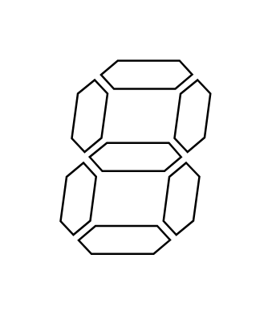

# 7 Segment Display

## Definition

```js
{
  _style: {
    entity: 'verticalLabelPosition=bottom;shadow=0;dashed=0;align=center;html=1;verticalAlign=top;shape=mxgraph.electrical.opto_electronics.7_segment_display;pointerEvents=1;',
  },
  _width: 74.7,
  _height: 96.1,
}
```

## Usage

```js
import { Component7SegmentDisplay } from '@dinghy/standard-components-diagrams/electricalOptical'

<Component7SegmentDisplay/>
```

## Preview


