# Electrical Resistors Entities

- [Attenuator](./attenuator.md)  
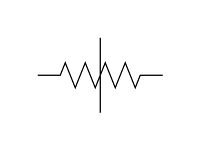

- [Magnetoresistor](./magnetoresistor.md)  
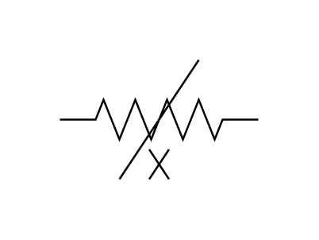

- [Memristor](./memristor.md)  
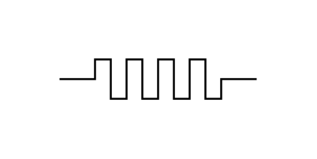

- [Memristor2](./memristor-2.md)  
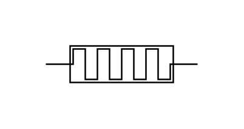

- [PhotoconductiveTransducerSymmetrical](./photoconductive-transducer-symmetrical.md)  
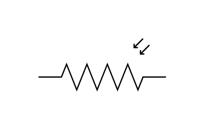

- [Potentiometer](./potentiometer.md)  
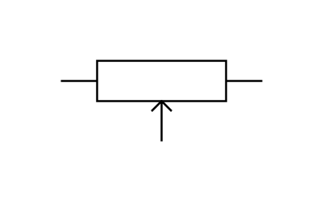

- [PotentiometerTrimmer](./potentiometer-trimmer.md)  
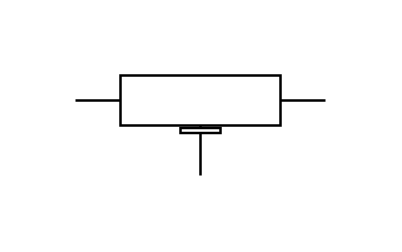

- [PotentiometerTrimmer2](./potentiometer-trimmer-2.md)  
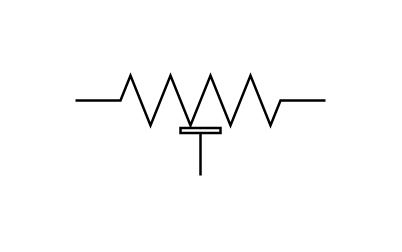

- [Potentiometer2](./potentiometer-2.md)  
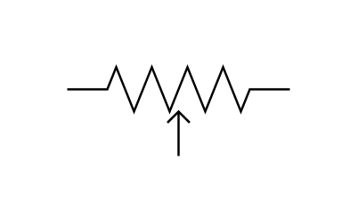

- [Resistor](./resistor.md)  
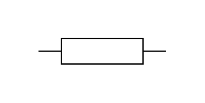

- [ResistorAdjustableContact](./resistor-adjustable-contact.md)  
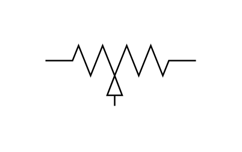

- [ResistorInstrumentRelayShunt](./resistor-instrument-relay-shunt.md)  
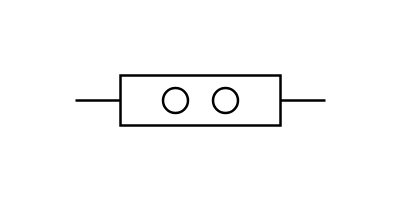

- [ResistorNonlinear](./resistor-nonlinear.md)  
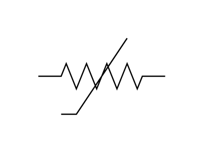

- [ResistorShunt](./resistor-shunt.md)  
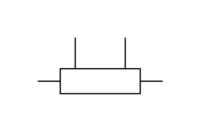

- [ResistorTapped](./resistor-tapped.md)  
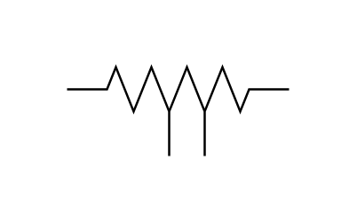

- [ResistorTrimmer](./resistor-trimmer.md)  
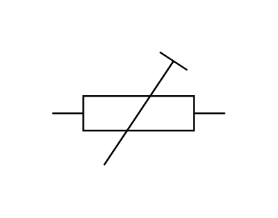

- [ResistorTrimmer2](./resistor-trimmer-2.md)  
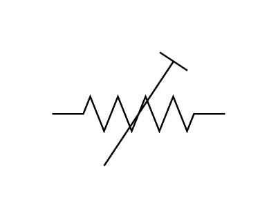

- [ResistorVariable](./resistor-variable.md)  
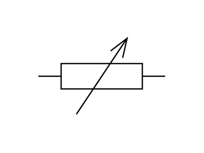

- [ResistorVariable2](./resistor-variable-2.md)  
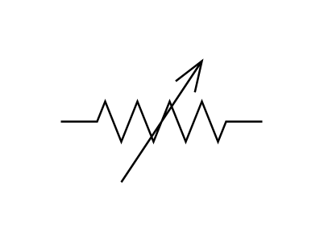

- [Resistor2](./resistor-2.md)  
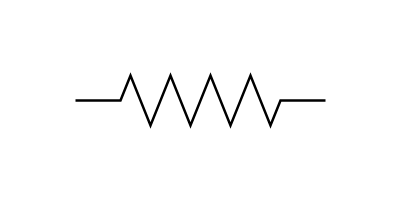

- [VaristorSymmetrical](./varistor-symmetrical.md)  
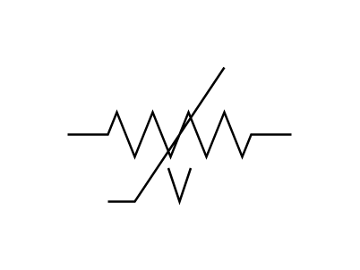
