# Electrical Rotating Equipment &amp; Mechanical Functions Entities

- [Armature](./armature.md)  

- [AutomaticReturn](./automatic-return.md)  
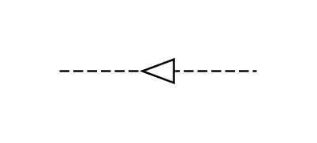

- [BlockingDevice](./blocking-device.md)  

- [Brake](./brake.md)  
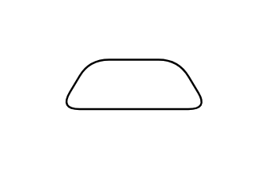

- [Clutch](./clutch.md)  
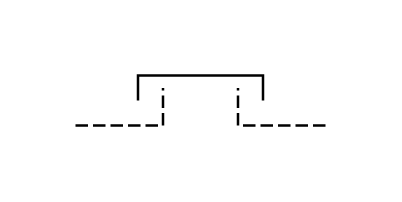

- [Clutch2](./clutch-2.md)  
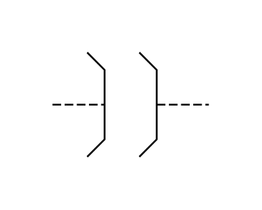

- [DelayedAction](./delayed-action.md)  
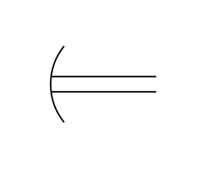

- [Detent](./detent.md)  

- [Field](./field.md)  
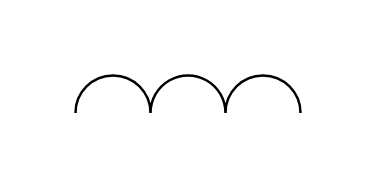

- [Gearing](./gearing.md)  
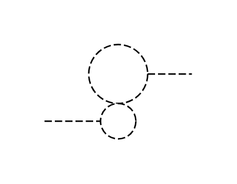

- [LatchingDevice](./latching-device.md)  
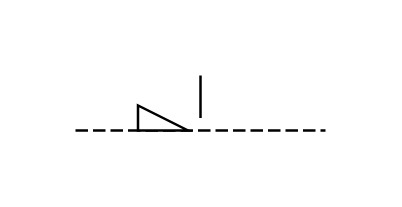

- [ManualControl](./manual-control.md)  
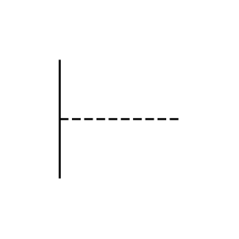

- [MechanicalInterlock](./mechanical-interlock.md)  
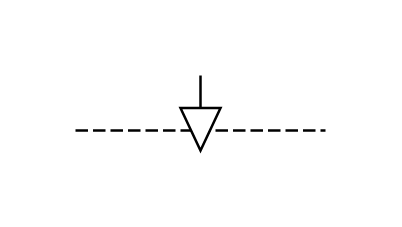

- [PermanentMagnet](./permanent-magnet.md)  
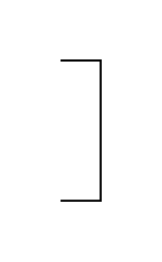

- [RotatingMachine](./rotating-machine.md)  

- [Rotation](./rotation.md)  
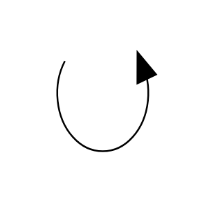

- [Synchro](./synchro.md)  
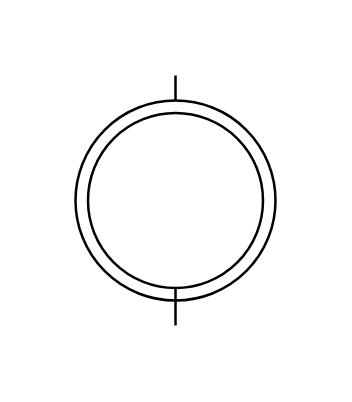

- [WindingConnection](./winding-connection.md)  
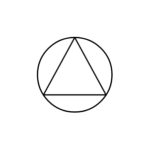
