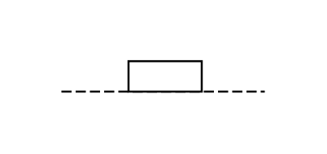

# Blocking Device

## Definition

```js
{
  _style: {
    entity: 'verticalLabelPosition=bottom;shadow=0;dashed=0;align=center;html=1;verticalAlign=top;shape=mxgraph.electrical.rot_mech.blocking_device;pointerEvents=1;',
  },
  _width: 100,
  _height: 15,
}
```

## Usage

```js
import { BlockingDevice } from '@dinghy/standard-components-diagrams/electricalRotatingEquipmentMechanicalFunctions'

<BlockingDevice/>
```

## Preview


