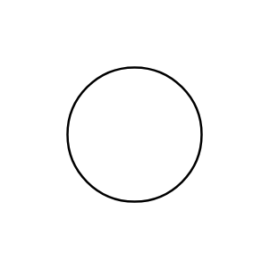

# Rotating Machine

## Definition

```js
{
  _style: {
    entity: 'verticalLabelPosition=middle;shadow=0;dashed=0;align=center;html=1;verticalAlign=middle;strokeWidth=1;shape=ellipse;fontSize=32;perimeter=ellipsePerimeter;',
  },
  _original_width: 100,
  _original_height: 100,

}
```

## Usage

```js
import { RotatingMachine } from '@dinghy/standard-components-diagrams/electricalRotatingEquipmentMechanicalFunctions'

<RotatingMachine/>
```

## Preview


