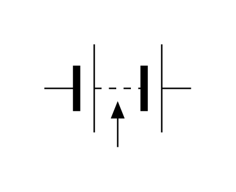

# Multicell Battery Tapped

## Definition

```js
{
  _style: {
    entity: 'pointerEvents=1;verticalLabelPosition=bottom;shadow=0;dashed=0;align=center;fillColor=strokeColor;html=1;verticalAlign=top;strokeWidth=1;shape=mxgraph.electrical.miscellaneous.multicell_battery_tapped;',
  },
  _width: 100,
  _height: 70,
}
```

## Usage

```js
import { MulticellBatteryTapped } from '@dinghy/standard-components-diagrams/electricalSources'

<MulticellBatteryTapped/>
```

## Preview


