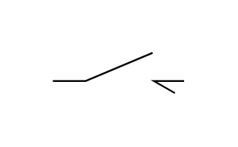

# Passing Make-Contact Off

## Definition

```js
{
  _style: {
    entity: 'pointerEvents=1;verticalLabelPosition=bottom;shadow=0;dashed=0;align=center;html=1;verticalAlign=top;shape=mxgraph.electrical.electro-mechanical.passingMakeContact2;elSwitchState=off;',
  },
  _width: 75,
  _height: 23,
}
```

## Usage

```js
import { PassingMakeContactOff } from '@dinghy/standard-components-diagrams/electricalSwitchesAndRelays'

<PassingMakeContactOff/>
```

## Preview


