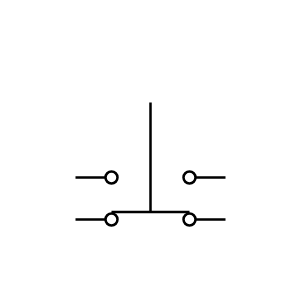

# Pushbutton 2-Circuit 2

## Definition

```js
{
  _style: {
    entity: 'pointerEvents=1;verticalLabelPosition=bottom;shadow=0;dashed=0;align=center;html=1;verticalAlign=top;shape=mxgraph.electrical.electro-mechanical.pushbuttonTwoCircuitSwitch2;elSwitchState=2;',
  },
  _original_width: 75,
  _original_height: 73,

}
```

## Usage

```js
import { Pushbutton2Circuit2 } from '@dinghy/standard-components-diagrams/electricalSwitchesAndRelays'

<Pushbutton2Circuit2/>
```

## Preview


