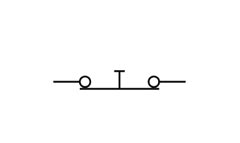

# Pushbutton On

## Definition

```js
{
  _style: {
    entity: 'html=1;shape=mxgraph.electrical.electro-mechanical.pushbutton;aspect=fixed;elSwitchState=on;',
  },
  _width: 75,
  _height: 20,
}
```

## Usage

```js
import { PushbuttonOn } from '@dinghy/standard-components-diagrams/electricalSwitchesAndRelays'

<PushbuttonOn/>
```

## Preview


