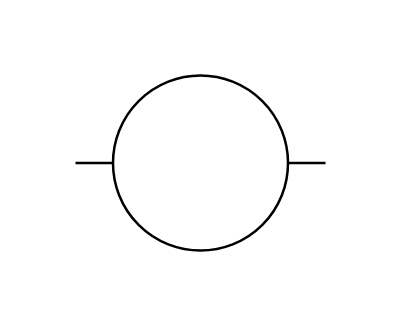

# Relay Coil 2

## Definition

```js
{
  _style: {
    entity: 'pointerEvents=1;verticalLabelPosition=bottom;shadow=0;dashed=0;align=center;html=1;verticalAlign=top;shape=mxgraph.electrical.electro-mechanical.relay_coil_2;',
  },
  _width: 100,
  _height: 70,
}
```

## Usage

```js
import { RelayCoil2 } from '@dinghy/standard-components-diagrams/electricalSwitchesAndRelays'

<RelayCoil2/>
```

## Preview


