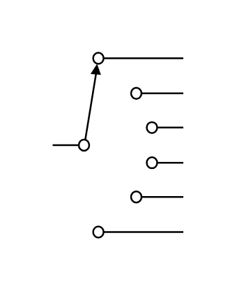

# Selector Switch (6 positions)

## Definition

```js
{
  _style: {
    entity: 'pointerEvents=1;verticalLabelPosition=bottom;shadow=0;dashed=0;align=center;html=1;verticalAlign=top;shape=mxgraph.electrical.electro-mechanical.selectorSwitch6Position2;elSwitchState=1;',
  },
  _width: 75,
  _height: 106,
}
```

## Usage

```js
import { SelectorSwitch6Positions } from '@dinghy/standard-components-diagrams/electricalSwitchesAndRelays'

<SelectorSwitch6Positions/>
```

## Preview


