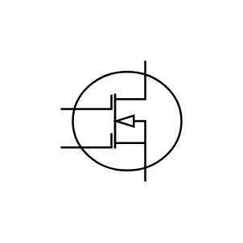

# Dual Gate MOSFET (N)

## Definition

```js
{
  _style: {
    entity: 'verticalLabelPosition=bottom;shadow=0;dashed=0;align=center;html=1;verticalAlign=top;shape=mxgraph.electrical.mosfets1.dual_gate_mosfet_n;',
  },
  _original_width: 95,
  _original_height: 100,

}
```

## Usage

```js
import { DualGateMosfetN } from '@dinghy/standard-components-diagrams/electricalTransistors'

<DualGateMosfetN/>
```

## Preview


