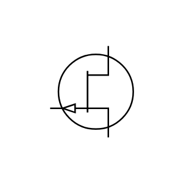

# P Channel JFET

## Definition

```js
{
  _style: {
    entity: 'verticalLabelPosition=bottom;shadow=0;dashed=0;align=center;html=1;verticalAlign=top;shape=mxgraph.electrical.transistors.p-channel_jfet_1;',
  },
  _original_width: 95,
  _original_height: 100,

}
```

## Usage

```js
import { PChannelJfet } from '@dinghy/standard-components-diagrams/electricalTransistors'

<PChannelJfet/>
```

## Preview


