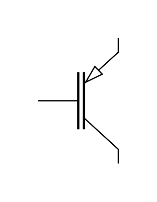

# PIGBT

## Definition

```js
{
  _style: {
    entity: 'verticalLabelPosition=bottom;shadow=0;dashed=0;align=center;html=1;verticalAlign=top;shape=mxgraph.electrical.transistors.pigbt;',
  },
  _width: 64,
  _height: 100,
}
```

## Usage

```js
import { Pigbt } from '@dinghy/standard-components-diagrams/electricalTransistors'

<Pigbt/>
```

## Preview


