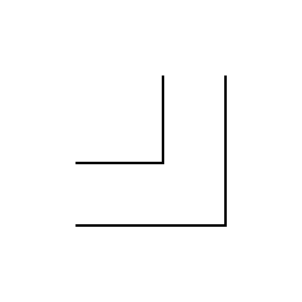
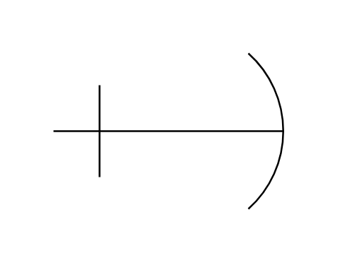
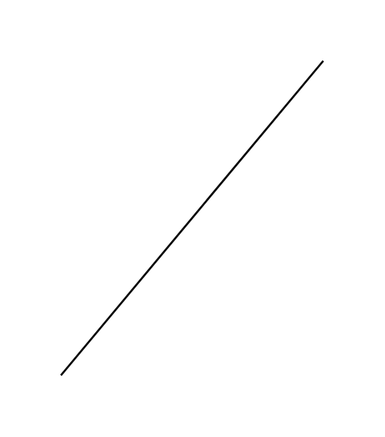
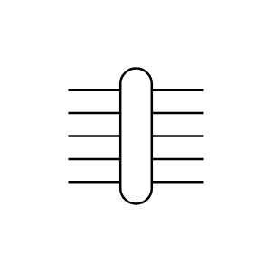
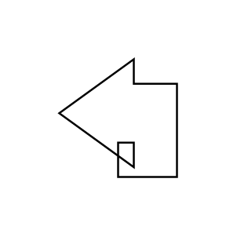
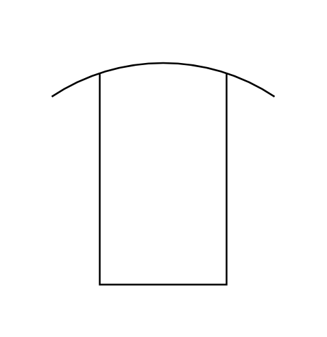
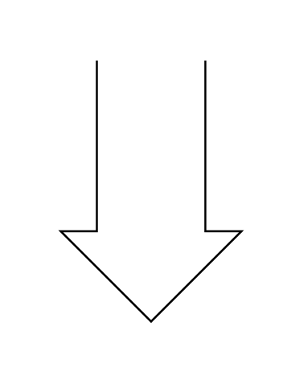

# Electrical Transmission Paths Entities

- [Component2LineBus](./component-2-line-bus.md)  

- [Component2LineBusElbow](./component-2-line-bus-elbow.md)  

- [Component3LineBus](./component-3-line-bus.md)  

- [Component3LineBusElbow](./component-3-line-bus-elbow.md)  

- [Component4LineBus](./component-4-line-bus.md)  

- [Component4LineBusElbow](./component-4-line-bus-elbow.md)  

- [Component8LineBus](./component-8-line-bus.md)  

- [Component8LineBusElbow](./component-8-line-bus-elbow.md)  

- [AnticreepageDevice](./anticreepage-device.md)  

- [BusWidth](./bus-width.md)  

- [CableGroup](./cable-group.md)  

- [ElbowBus](./elbow-bus.md)  

- [ElbowBus2](./elbow-bus-2.md)  

- [LineConcentrator](./line-concentrator.md)  

- [LineCable](./line-cable.md)  

- [OpticalFiber](./optical-fiber.md)  

- [OvergroundEnclosure](./overground-enclosure.md)  

- [StraightBus](./straight-bus.md)  

- [Terminal](./terminal.md)  

- [Terminal2](./terminal-2.md)  

- [Terminal3Phase](./terminal-3-phase.md)  

- [TestPoint](./test-point.md)  

