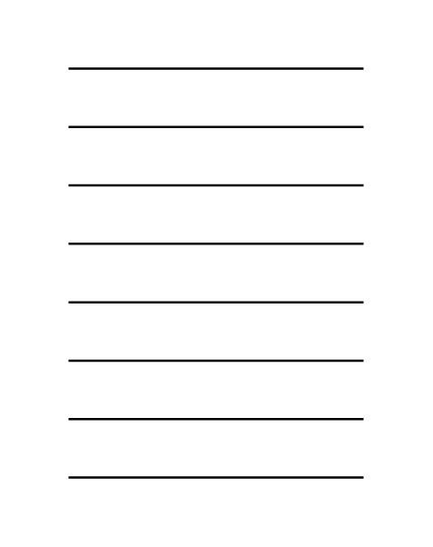

# 8-Line Bus

## Definition

```js
{
  _style: {
    entity: 'verticalLabelPosition=bottom;shadow=0;dashed=0;align=center;html=1;verticalAlign=top;shape=mxgraph.electrical.transmission.8_line_bus;',
  },
  _width: 130,
  _height: 180,
}
```

## Usage

```js
import { Component8LineBus } from '@dinghy/standard-components-diagrams/electricalTransmissionPaths'

<Component8LineBus/>
```

## Preview


