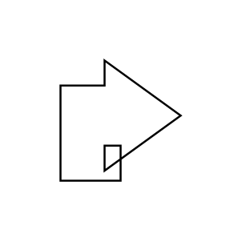

# Elbow Bus

## Definition

```js
{
  _style: {
    entity: 'html=1;shadow=0;dashed=0;align=center;verticalAlign=middle;shape=mxgraph.arrows2.bendArrow;dy=15;dx=38;notch=0;arrowHead=55;rounded=0;strokeWidth=1',
  },
  _original_width: 130,
  _original_height: 130,

}
```

## Usage

```js
import { ElbowBus } from '@dinghy/standard-components-diagrams/electricalTransmissionPaths'

<ElbowBus/>
```

## Preview


