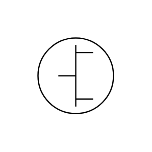

# Line Concentrator

## Definition

```js
{
  _style: {
    entity: 'verticalLabelPosition=bottom;shadow=0;dashed=0;align=center;html=1;verticalAlign=top;shape=mxgraph.electrical.transmission.line_concentrator;',
  },
  _original_width: 130,
  _original_height: 130,

}
```

## Usage

```js
import { LineConcentrator } from '@dinghy/standard-components-diagrams/electricalTransmissionPaths'

<LineConcentrator/>
```

## Preview


