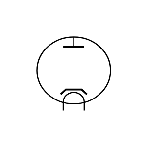
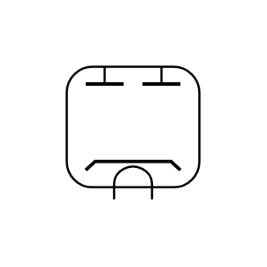
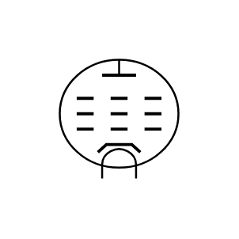
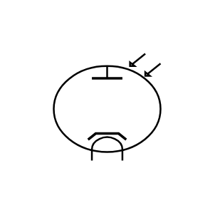
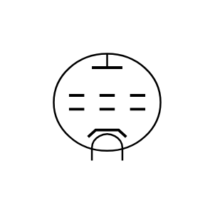
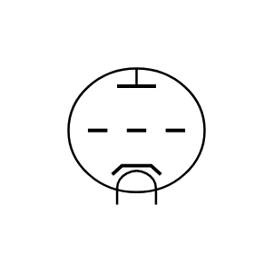

# Electrical Vacuum Tubes Entities

- [Diode](./diode.md)  

- [DoubleDiode](./double-diode.md)  

- [DoubleTriode](./double-triode.md)  

- [Pentode](./pentode.md)  

- [Photocell](./photocell.md)  

- [Tetrode](./tetrode.md)  

- [Triode](./triode.md)  

