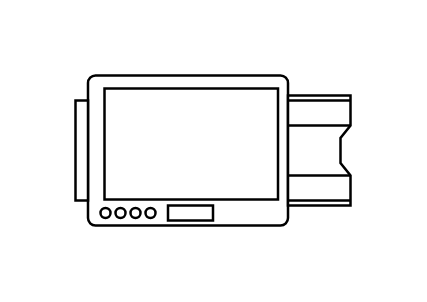

# Copier

## Definition

```js
{
  _style: {
    entity: 'verticalLabelPosition=bottom;html=1;verticalAlign=top;align=center;shape=mxgraph.floorplan.copier;',
  },
  _width: 110,
  _height: 60,
}
```

## Usage

```js
import { Copier } from '@dinghy/standard-components-diagrams/floorPlans'

<Copier/>
```

## Preview


