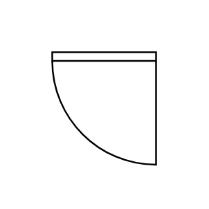

# Door 2

## Definition

```js
{
  _style: {
    entity: 'verticalLabelPosition=bottom;html=1;verticalAlign=top;align=center;shape=mxgraph.floorplan.doorRight;aspect=fixed;',
  },
  _original_width: 80,
  _original_height: 85,

}
```

## Usage

```js
import { Door2 } from '@dinghy/standard-components-diagrams/floorPlans'

<Door2/>
```

## Preview


