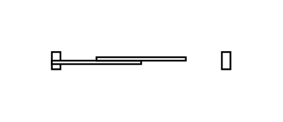

# Door, SlidingGlass

## Definition

```js
{
  _style: {
    entity: 'verticalLabelPosition=bottom;html=1;verticalAlign=top;align=center;shape=mxgraph.floorplan.doorSlidingGlass;dx=0.25;',
  },
  _width: 104,
  _height: 10,
}
```

## Usage

```js
import { DoorSlidingglass } from '@dinghy/standard-components-diagrams/floorPlans'

<DoorSlidingglass/>
```

## Preview


