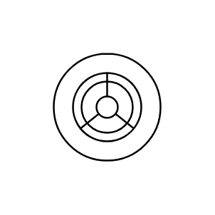

# Floor Lamp

## Definition

```js
{
  _style: {
    entity: 'verticalLabelPosition=bottom;html=1;verticalAlign=top;align=center;shape=mxgraph.floorplan.floor_lamp;',
  },
  _original_width: 50,
  _original_height: 50,

}
```

## Usage

```js
import { FloorLamp } from '@dinghy/standard-components-diagrams/floorPlans'

<FloorLamp/>
```

## Preview


