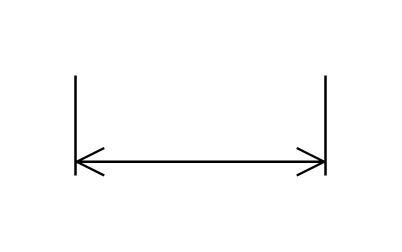

# Horizontal Dimension

## Definition

```js
{
  _style: {
    entity: 'shape=dimension;whiteSpace=wrap;html=1;align=center;points=[];verticalAlign=bottom;spacingBottom=3;labelBackgroundColor=none;',
  },
  _width: 100,
  _height: 40,
}
```

## Usage

```js
import { HorizontalDimension } from '@dinghy/standard-components-diagrams/floorPlans'

<HorizontalDimension/>
```

## Preview


