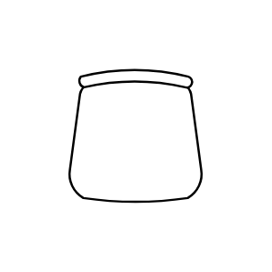

# Office Chair

## Definition

```js
{
  _style: {
    entity: 'verticalLabelPosition=bottom;html=1;verticalAlign=top;align=center;shape=mxgraph.floorplan.office_chair;',
  },
  _original_width: 40,
  _original_height: 43,

}
```

## Usage

```js
import { OfficeChair } from '@dinghy/standard-components-diagrams/floorPlans'

<OfficeChair/>
```

## Preview


