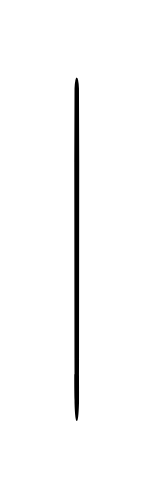

# Office table 3

## Definition

```js
{
  _style: {
    entity: 'verticalLabelPosition=bottom;html=1;verticalAlign=top;align=center;shape=mxgraph.floorplan.office_chair;shadow=0;direction=west;',
  },
  _width: 1,
  _height: 140,
}
```

## Usage

```js
import { OfficeTable3 } from '@dinghy/standard-components-diagrams/floorPlans'

<OfficeTable3/>
```

## Preview


