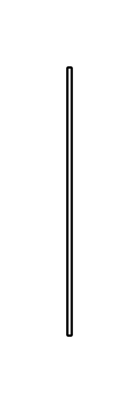

# Small kitchen table 3

## Definition

```js
{
  _style: {
    entity: 'shape=rect;shadow=0;html=1;',
  },
  _width: 2,
  _height: 120,
}
```

## Usage

```js
import { SmallKitchenTable3 } from '@dinghy/standard-components-diagrams/floorPlans'

<SmallKitchenTable3/>
```

## Preview


