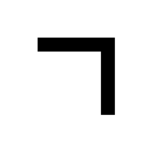

# Wall (Corner NE)

## Definition

```js
{
  _style: {
    entity: 'verticalLabelPosition=bottom;html=1;verticalAlign=top;align=center;shape=mxgraph.floorplan.wallCorner;fillColor=strokeColor;direction=south;',
  },
  _original_width: 100,
  _original_height: 100,

}
```

## Usage

```js
import { WallCornerNe } from '@dinghy/standard-components-diagrams/floorPlans'

<WallCornerNe/>
```

## Preview


