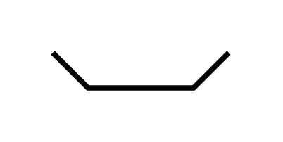

# Window, Bow

## Definition

```js
{
  _style: {
    entity: 'verticalLabelPosition=bottom;html=1;verticalAlign=top;align=center;shape=mxgraph.floorplan.windowBow;strokeWidth=3;',
  },
  _width: 100,
  _height: 20,
}
```

## Usage

```js
import { WindowBow } from '@dinghy/standard-components-diagrams/floorPlans'

<WindowBow/>
```

## Preview


