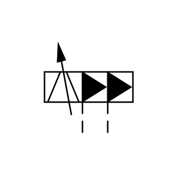

# X10200 Hydraulic control

## Definition

```js
{
  _style: {
    entity: 'verticalLabelPosition=bottom;aspect=fixed;html=1;verticalAlign=top;fillColor=strokeColor;align=center;outlineConnect=0;shape=mxgraph.fluid_power.x10200;points=[[0,0.31,0],[0,0.48,0],[0,0.65,0],[1,0.31,0],[1,0.48,0],[1,0.65,0],[0.43,1,0],[0.715,1,0]]',
  },
  _original_width: 64.82,
  _original_height: 53.86,

}
```

## Usage

```js
import { X10200HydraulicControl } from '@dinghy/standard-components-diagrams/fluidPower'

<X10200HydraulicControl/>
```

## Preview


